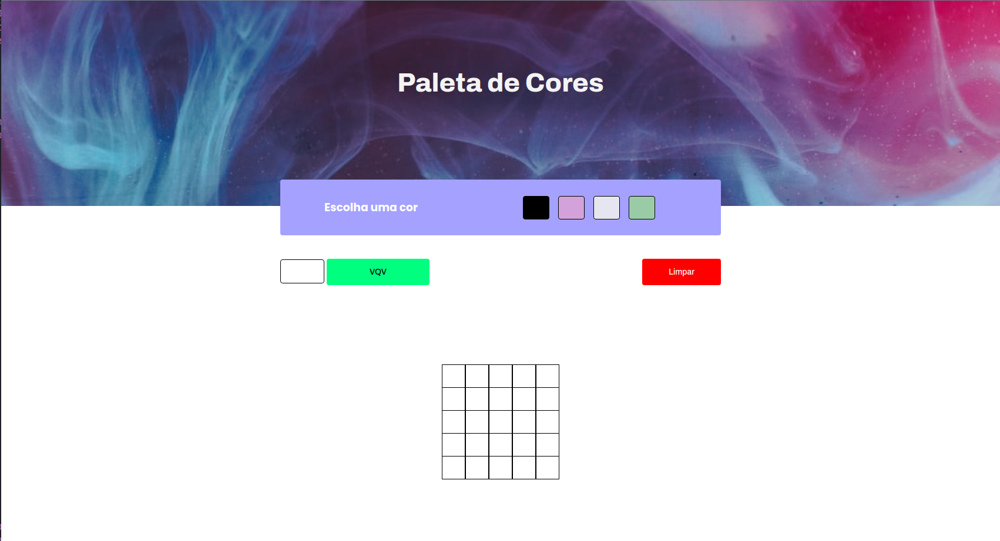

# Pixels Art 

## O projeto pixels art, foi desenvolvido como requisito para obtensão de nota, referente ao curso de Desenvolvimento de Software na trybe, no módulo de fundamentos da Web, é uma página web que contém uma paleta de cores funcional que poderá ser utilizada para criar desenhos em pixels. Para isto foi ultilizado javascript, css e html.

<h4 align="center"> 
	🚧  Pixels Art 🚀 Concluído  🚧
</h4>

### Principais ações

- [x] Paleta de cores
- [x] Gera cores aleátória
- [x] Clicar em uma das cores da paleta faz com que ela seja selecionada e utilizada para preencher os pixels no quadro.
- [x] Clicar no botão limpar, limpa o quadro preenchendo a cor de todos seus pixels com branco.
- [x] Seu tamanho pode ser definido pela pessoa usuária.

### Demonstração projeto pronto

<h1 align="center">
  
  
  
</h1>