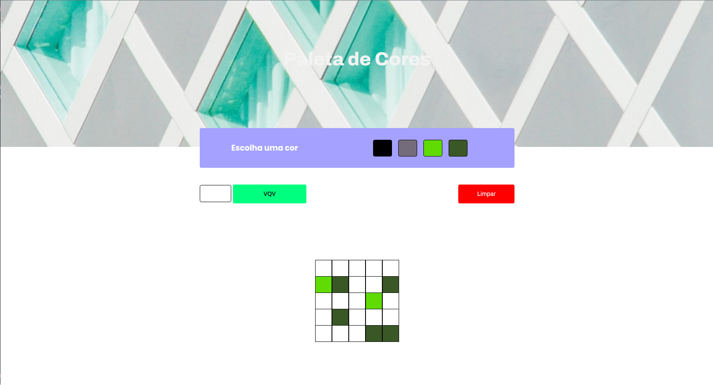
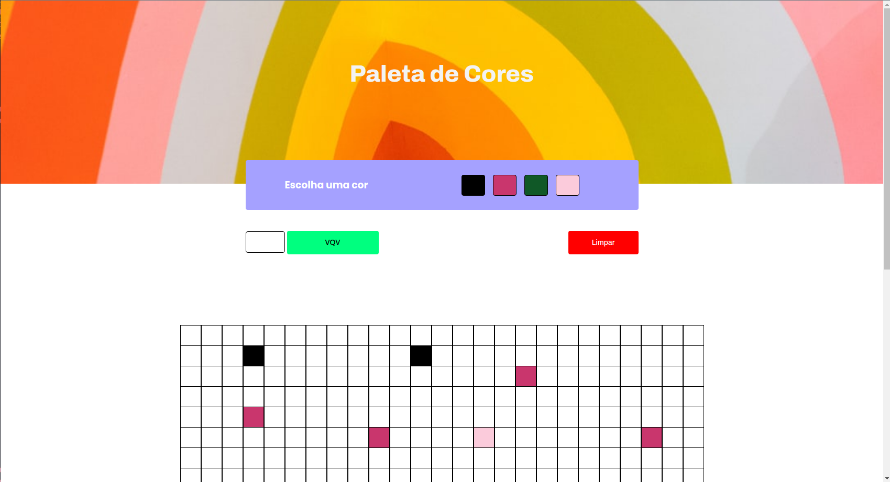

# Pixels Art 

O projeto pixels art, foi desenvolvido como requisito para obtensão de nota, referente ao curso de Desenvolvimento de Software na trybe, no módulo de fundamentos da Web, é uma página web que contém uma paleta de cores funcional que poderá ser utilizada para criar desenhos em pixels. Para isto foi ultilizado javascript, css e html.

<h4 align="center"> 
	🚧  Pixels Art 🚀 Concluído  🚧
</h4>

### :hotsprings: Habilidades 

As seguintes habilidades foram ultilizadas na construção do projeto:

- Manipulação CSS
- Manipulação HTML
- Manipulação JavaScript

### 🛠 Tecnologias

As seguintes ferramentas foram usadas na construção do projeto:

- [Html](https://htmlreference.io/)
- [Css](https://developer.mozilla.org/pt-BR/docs/Web/CSS)
- [JavaScript](https://developer.mozilla.org/pt-BR/docs/Web/javascript)
- [Vscode](https://code.visualstudio.com/)

### :dart: Principais ações

- [x] Paleta de cores
- [x] Gera cores aleátória
- [x] Clicar em uma das cores da paleta faz com que ela seja selecionada e utilizada para preencher os pixels no quadro.
- [x] Clicar no botão limpar, limpa o quadro preenchendo a cor de todos seus pixels com branco.
- [x] Seu tamanho pode ser definido pela pessoa usuária.

### :movie_camera: Demonstração projeto pronto

<h1 align="center" >
  
     
      
     
    
</h1>